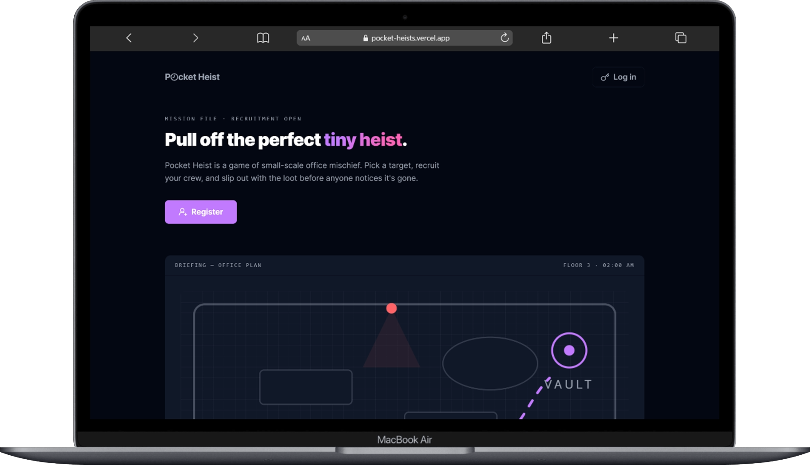

# 💼 Pocket Heist

> Tiny missions. Big office mischief. A realtime heist planner built with the **opencode coding agent**.

Pocket Heist lets you assign short, deadline-bound "heists" to teammates, follow their status in real time, and close them out as success or failure. Built with Next.js and Firebase.

[](./LICENSE)
[](./package.json)

## Demo

_Note: the live app is deployed on Vercel — check it out at [pocket-heists.vercel.app](https://pocket-heists.vercel.app/)._

Homepage / dashboard preview:



## Features

- **Realtime per-user heist lists** — the dashboard subscribes to Firestore and splits heists into *Active*, *Assigned*, and *Expired* tabs, scoped to the signed-in user.
- **Create-a-heist flow** — assign a title, description, and a teammate to a heist with a 48-hour deadline and auto-generated codenames.
- **Per-heist mission dossier** — open any heist to view its details, assigned teammate, deadline, and status on a dedicated page with a live single-document listener.
- **Status & expiry derivations** — shared deadline/expiry phrasing, threaded through a ticking clock so list text and per-heist text always agree.
- **Authenticated routes** — `RouteGuard` + `AuthForm` gate every dashboard page; sign up and log in with Firebase email/password.
- **Component gallery** — a `/preview` route showcases every UI component in isolation for fast iteration.

## Tech Stack

- **Framework:** [Next.js 16](https://nextjs.org/) (App Router), [React 19](https://react.dev/)
- **Language:** [TypeScript](https://www.typescriptlang.org/)
- **Styling:** [Tailwind CSS v4](https://tailwindcss.com/) + CSS Modules
- **Backend:** [Firebase](https://firebase.google.com/) (Authentication + Cloud Firestore)
- **Icons:** [lucide-react](https://lucide.dev/)
- **Tooling:** [Vitest](https://vitest.dev/) + [Testing Library](https://testing-library.com/), [ESLint](https://eslint.org/), [Husky](https://typicode.github.io/husky/) + [commitlint](https://commitlint.js.org/)

## Getting Started

### Prerequisites

- **Node.js 20+** (developed on v24). No database to install — Firestore is hosted in the cloud.
- A **Firebase project** with Authentication (Email/Password) and Cloud Firestore enabled. Copy the web-app config from the Firebase Console (Project settings → Your apps → SDK setup).

> ⚠️ **Windows / PowerShell note:** the default execution policy blocks `npm`/`npx` scripts. Run them through `cmd /c "..."`, e.g. `cmd /c "npm run dev"`.

### Install & Run

```bash
# 1. Clone the repository
git clone https://github.com/<you>/pocket-heist.git
cd pocket-heist

# 2. Install dependencies
npm install

# 3. Configure environment variables
cp .env.example .env   # then fill in your Firebase values (see table below)

# 4. Run the dev server
npm run dev            # or: cmd /c "npm run dev" on Windows/PowerShell
```

Open [http://localhost:3000](http://localhost:3000) to view the app.

## Environment Variables

| Key | Description | Required |
| --- | --- | --- |
| `NEXT_PUBLIC_FIREBASE_API_KEY` | Firebase web app API key | ✅ Yes |
| `NEXT_PUBLIC_FIREBASE_AUTH_DOMAIN` | Auth domain (`<project>.firebaseapp.com`) | ✅ Yes |
| `NEXT_PUBLIC_FIREBASE_PROJECT_ID` | Firebase project ID | ✅ Yes |
| `NEXT_PUBLIC_FIREBASE_STORAGE_BUCKET` | Storage bucket name | ✅ Yes |
| `NEXT_PUBLIC_FIREBASE_MESSAGING_SENDER_ID` | Messaging sender ID | ✅ Yes |
| `NEXT_PUBLIC_FIREBASE_APP_ID` | Firebase web app ID | ✅ Yes |

## Usage

1. **Sign up / log in** — create an account or sign in at `/signup` or `/login` (Firebase email/password).
2. **Create a heist** — from the dashboard go to `/heists/create`, pick a title and a teammate, and submit. A codename is generated for each participant and the deadline is set 48 hours out.
3. **Track heists** — the dashboard shows your **Active** (assigned to you), **Assigned** (created by you), and **Expired** heists in real time, sorted by deadline.
4. **Open a mission dossier** — click any heist to view its full details, assigned teammate, and deadline; the page stays live via a Firestore listener.

## Project Structure

```
pocket-heist/
├── app/
│   ├── (public)/          # No-auth pages: splash / and /preview
│   ├── (auth)/            # No-auth pages: /login, /signup
│   ├── (dashboard)/       # Auth-gated pages with Navbar: /heists, .../create, .../[id]
│   ├── layout.tsx         # Root layout mounting <UserProvider />
│   └── globals.css        # Tailwind v4 @theme tokens + global utilities
├── components/<Name>/     # One folder per component (Name.module.css + index barrel)
├── hooks/                 # Data layer: useHeists (realtime lists), useHeist (single doc)
├── types/firestore/       # Collection schemas + converters + COLLECTIONS constants
├── lib/                   # firebase init, codename gen, date/deadline utils
├── tests/                 # Mirror of components/hooks/lib/pages
│   ├── components/
│   ├── hooks/
│   ├── lib/
│   └── pages/
├── _specs/                # Feature specs
├── public/                # Static assets, incl. the demo screenshot
└── package.json
```

Path alias `@/*` maps to the project root.

## Testing

Run the full suite:

```bash
npm test               # or: cmd /c "npm test" on Windows/PowerShell
```

Run a single test file:

```bash
npx vitest run tests/components/Navbar.test.tsx
```

Covered areas: components (`AuthForm`, `CreateHeistForm`, `HeistCard`, `Navbar`, `RouteGuard`, and more), hooks (`useHeists`, `useHeist` — including the Firestore mocking pattern), lib utils (`codename`, `dateUtils`), and page smoke tests. Tests use **Vitest + Testing Library** with jsdom.

> ⚠️ **Coverage note:** coverage reporting is not currently available (`@vitest/coverage-v8` is not installed), so `--coverage` will fail.

## Deployment

The app is deployed on **Vercel** at [https://pocket-heists.vercel.app/](https://pocket-heists.vercel.app/). Pushing to the default branch triggers a production build via Vercel's Git integration. Firebase config lives in `firebase.json` (Firestore + Auth rules) — no local hosting config is required.

## Roadmap / Known Issues

- **Coverage tooling** — `@vitest/coverage-v8` isn't installed, so there's no coverage gate yet.
- **Windows execution policy** — `npm`/`npx` need the `cmd /c` wrapper on PowerShell (documented above).
- **Early-stage project** — status/expiry derivations are intentionally render-only; realtime consolidation of per-user lists is still being refined.
- **Deployment** — hosted on Vercel, but no CI checks (build/tests) are wired into the pipeline yet.

## License

Released under the [MIT License](./LICENSE).

## Contact

- **Portfolio:** [gladwinramantso.netlify.app](https://gladwinramantso.netlify.app/)
- **LinkedIn:** [gladwinramantso](https://www.linkedin.com/in/gladwinramantso/)
